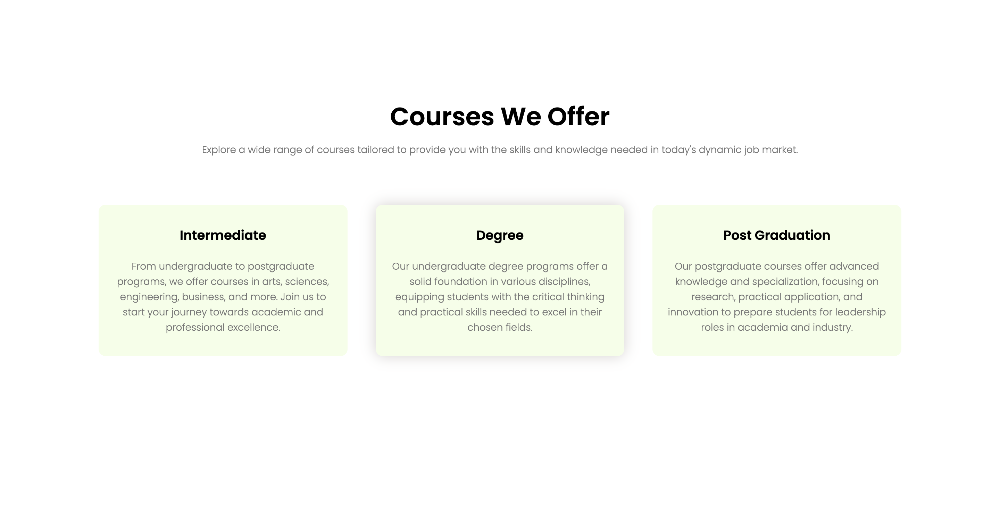
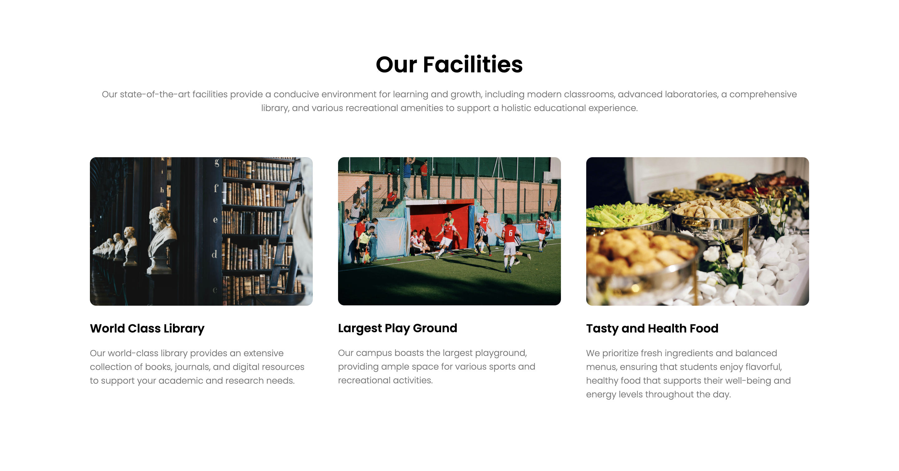
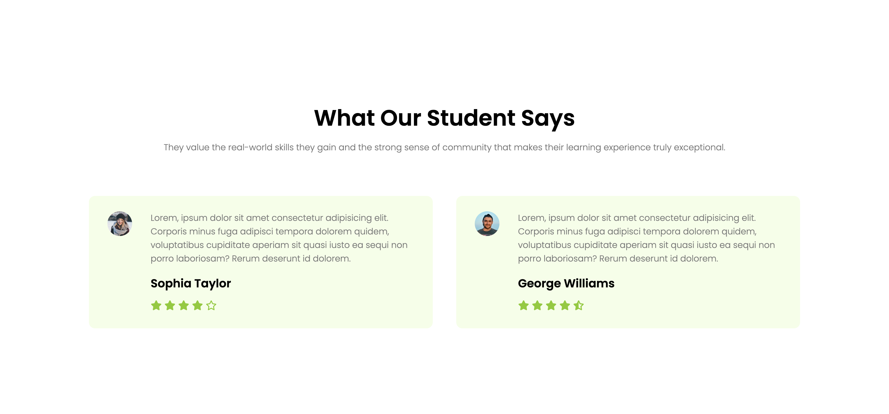
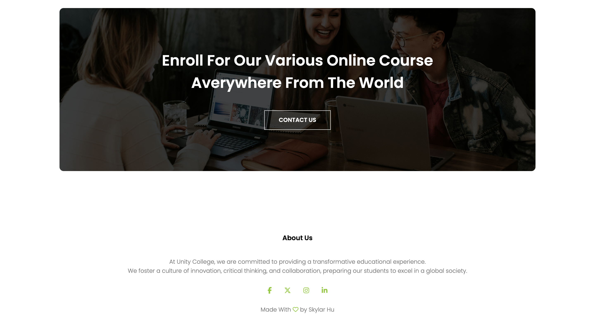

# Unity College Website

This repository contains the source code for the Unity College website, a responsive educational institution website designed to provide information about courses, campus, facilities, and more.

## Project Overview

The Unity College website is a static, responsive site designed to showcase the college's offerings, including courses, campus locations, and facilities. The website is structured with HTML, styled with CSS, and enhanced with JavaScript for interactivity. It is aimed at providing prospective students and visitors with a comprehensive view of what Unity College has to offer.

## Features

- Responsive design that adapts to various screen sizes.
- Navigation menu with toggle feature for mobile view.
- Sections highlighting courses offered, global campuses, facilities, and testimonials.
- Integration with Font Awesome for icons.
- Includes a contact call-to-action section.
- Footer with social media links.

## Technologies Used

- **HTML5**: Structure of the website.
- **CSS3**: Styling of the website, including the use of Flexbox for layout.
- **JavaScript**: Adding interactivity to the navigation menu.
- **Google Fonts**: For custom font styles.
- **Font Awesome**: For social media and other icons.

## Screenshots

